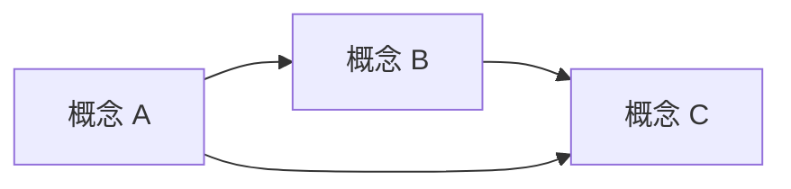

# {{章节标题}}

> **本课程面向**：已有 Phase N-1 基础知识，希望系统理解 Phase N 覆盖范围内的读者。

---

## 学习地图

本课程回答的核心问题链：

1. 问题 A（→ 概念 A）
2. 问题 B（→ 概念 B）
3. 问题 C（→ 概念 C）

---

## 第一站：{{概念 A}}

### 一句话解释

### 类比

### 核心机制

### 我们的场景中这意味着什么

> **关联微课程**：详细解释请参考 [[链接到微课程]]

---

## 第二站：{{概念 B}}

...

---

## 第三站：{{概念 C}}

...

---

## 概念关系图

---

## 对本项目方案选型的综合影响

| 需求 | 受影响的方案方向 | 关键约束 |
|------|----------------|---------|
| R 序号 | 方案 A/B/C/D/E | 说明 |

---

## 继续学习路径

- 下一步章节：[[链接]]
- 相关的微课程：[[链接]]
- 深入原始资料：`raw/xxx`

---

## 参考资料

- [[wiki/页面.md]]
- 等
