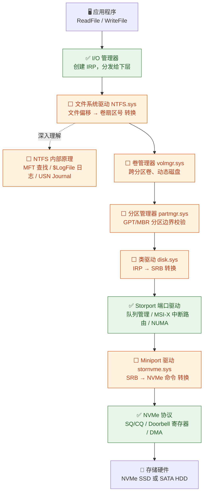
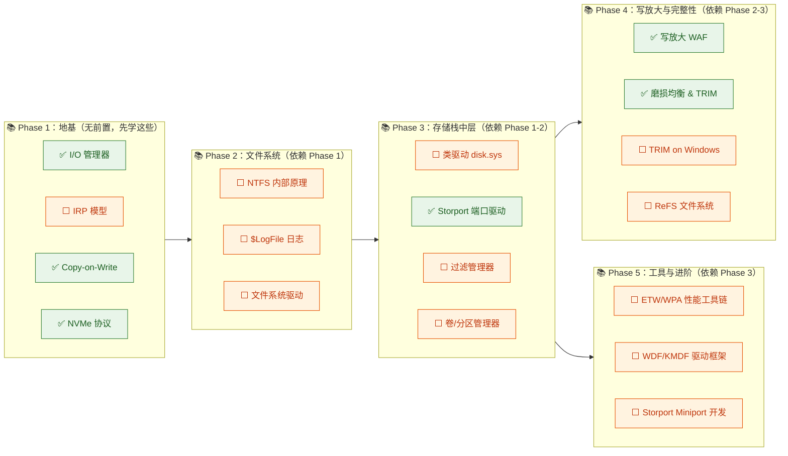
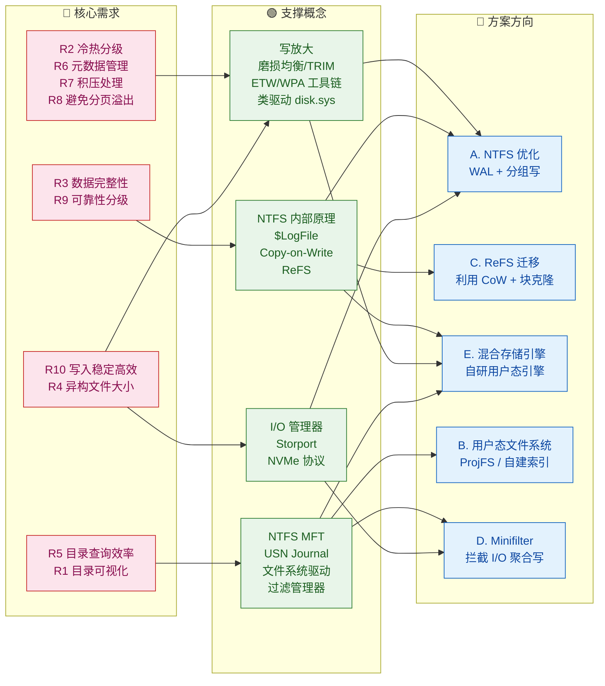

# Windows 高性能存储方案 — 知识图谱

> 基于 [[requirements.md]] 生成，覆盖方案 A–E 全部技术预研所需知识。

---

## 一、概念全景分类

| 分类   | 目录                    | 所需概念                                                                  |
| ---- | --------------------- | --------------------------------------------------------------------- |
| 存储栈层 | `wiki/storage-stack/` | I/O 管理器、IRP 模型、文件系统驱动、过滤管理器、卷管理器、分区管理器、类驱动、端口驱动(Storport)、Miniport 驱动 |
| 文件系统 | `wiki/filesystems/`   | NTFS 内部原理、NTFS $LogFile、ReFS                                          |
| 基础概念 | `wiki/concepts/`      | Copy-on-Write、写放大、磨损均衡、TRIM/UNMAP                                     |
| 存储协议 | `wiki/protocols/`     | NVMe 协议                                                               |
| 性能分析 | `wiki/performance/`   | Windows 性能工具链 (ETW/WPA/PerfMon)                                       |
| 驱动开发 | `wiki/driver-model/`  | WDF/KMDF、Storport Miniport 开发                                         |
| 存储方案 | `wiki/solutions/`     | Storage Spaces / S2D                                                  |

---

## 二、知识图谱（三张图）

### 图 1：Windows 存储栈 — 一条 I/O 请求的完整路径

> **这是理解所有方案的基础**。一次 `ReadFile()` / `WriteFile()` 调用经过的每一层。
> 图中 ✅ = Wiki 页已存在，⬜ = 待创建。

> **阅读顺序**：**从上往下**，每层只做一件事，对下层透明。这是 Windows 存储栈的"主干"，所有方案都在此基础上做文章。

---

### 图 2：项目概念依赖树 — 先学什么、后学什么

> 按 **Phase 1→5** 拓扑排列。箭头 = "必须先理解 A 才能理解 B"。
> **同一 Phase 内无先后顺序，可并行学习。**

> **学习策略**：先吃透 Phase 1 的 4 个概念（其中 3 个 Wiki 页已就绪），再逐 Phase 深入。
> 每个 Phase 内部的节点**平级**，没有顺序要求。

---

### 图 3：需求 → 概念 → 方案 映射图

> 10 条核心需求各自需要哪些概念来支撑，最终导向哪个方案方向。

> 从左到右阅读：**需求驱动概念学习，概念支撑方案选型**。

---

## 三、学习路径表

按**拓扑序**排列（从无前置依赖到有前置依赖）。每个 Phase 内的概念可并行学习。

### Phase 1：基础概念（全方向通用）

| 顺序  | 概念            | 前置依赖    | 对应 Wiki 页面                                                        | 状态        | 优先级 |
| --- | ------------- | ------- | ----------------------------------------------------------------- | --------- | --- |
| 1.1 | I/O 管理器       | 无       | [[wiki/storage-stack/i-o-manager.md]] | ✅ 已存在     | P0  |
| 1.2 | IRP 模型        | I/O 管理器 | [[wiki/storage-stack/i-o-manager.md#IRP]]（内嵌）                     | ⬜ 需提取为独立页 | P0  |
| 1.3 | Copy-on-Write | 无       | [[wiki/concepts/copy-on-write.md]]                                | ✅ 已存在     | P0  |
| 1.4 | NVMe 协议       | PCIe 基础 | [[wiki/protocols/nvme.md]]                                        | ✅ 已存在     | P1  |

### Phase 2：文件系统核心

| 顺序  | 概念            | 前置依赖            | 对应 Wiki 页面                                  | 状态    | 优先级 |
| --- | ------------- | --------------- | ------------------------------------------- | ----- | --- |
| 2.1 | NTFS 内部原理     | I/O 管理器, IRP 模型 | `wiki/filesystems/ntfs.md`                  | ⬜ 待创建 | P0  |
| 2.2 | NTFS $LogFile | NTFS 内部原理       | `wiki/filesystems/ntfs.md#$LogFile`（内嵌）     | ⬜ 待创建 | P0  |
| 2.3 | 文件系统驱动        | I/O 管理器         | `wiki/storage-stack/file-system-drivers.md` | ⬜ 待创建 | P0  |

### Phase 3：存储栈中间层

| 顺序  | 概念              | 前置依赖          | 对应 Wiki 页面                             | 状态    | 优先级 |
| --- | --------------- | ------------- | -------------------------------------- | ----- | --- |
| 3.1 | 过滤管理器           | 文件系统驱动        | `wiki/storage-stack/filter-manager.md` | ⬜ 待创建 | P1  |
| 3.2 | 卷管理器 + 分区管理器    | I/O 管理器       | `wiki/storage-stack/volume-manager.md` | ⬜ 待创建 | P2  |
| 3.3 | 类驱动 (disk.sys)  | IRP 模型, 分区管理器 | `wiki/storage-stack/class-drivers.md`  | ⬜ 待创建 | P1  |
| 3.4 | 端口驱动 (Storport) | 类驱动           | [[wiki/storage-stack/port-drivers.md]] | ✅ 已存在 | P0  |

### Phase 4：写放大与数据完整性

| 顺序  | 概念                    | 前置依赖                 | 对应 Wiki 页面                               | 状态    | 优先级 |
| --- | --------------------- | -------------------- | ---------------------------------------- | ----- | --- |
| 4.1 | 写放大                   | NTFS, TRIM, SSD GC   | [[wiki/concepts/write-amplification.md]] | ✅ 已存在 | P0  |
| 4.2 | 磨损均衡 & TRIM           | SSD 硬件, NVMe         | [[wiki/concepts/wear-leveling.md]]       | ✅ 已存在 | P0  |
| 4.3 | TRIM/UNMAP on Windows | NTFS, Storport, NVMe | `wiki/concepts/trim-unmap-windows.md`    | ⬜ 待创建 | P1  |
| 4.4 | ReFS                  | NTFS 基础, CoW         | `wiki/filesystems/refs.md`               | ⬜ 待创建 | P1  |

### Phase 5：性能分析与开发

| 顺序  | 概念                   | 前置依赖               | 对应 Wiki 页面                                   | 状态    | 优先级 |
| --- | -------------------- | ------------------ | -------------------------------------------- | ----- | --- |
| 5.1 | Windows 性能工具链        | I/O 管理器            | `wiki/performance/windows-perf-tooling.md`   | ⬜ 待创建 | P0  |
| 5.2 | WDF/KMDF             | IRP 模型             | `wiki/driver-model/wdf-kmdf.md`              | ⬜ 待创建 | P2  |
| 5.3 | Storport Miniport 开发 | Storport, WDF/KMDF | `wiki/driver-model/storport-miniport-dev.md` | ⬜ 待创建 | P2  |
| 5.4 | Storage Spaces       | 卷管理器               | `wiki/solutions/storage-spaces.md`           | ⬜ 待创建 | P2  |

### 方案方向 → 概念映射

| 方案                | 必需概念（Phase 顺序）                                |
| ----------------- | --------------------------------------------- |
| **A. NTFS 优化**    | 1.1 → 2.1 → 2.2 → 3.3 → 3.4 → 4.1 → 4.2 → 5.1 |
| **B. 用户态 FS**     | 1.1 → 2.3 → 3.1 → 5.1                         |
| **C. ReFS 迁移**    | 1.1 → 1.3 → 2.1 → 4.4 → 5.1                   |
| **D. Minifilter** | 1.1 → 1.2 → 2.3 → 3.1 → 5.2                   |
| **E. 混合引擎**       | 1.1 → 2.1 → 2.2 → 4.1 → 5.1                   |

---

## 四、待收集资料表

| 优先级    | 主题                            | 建议搜索词（含 Windows 特定）                                                                                                                                | 目标 raw/ 路径                               | 关联 Wiki 页面                                |
| ------ | ----------------------------- | -------------------------------------------------------------------------------------------------------------------------------------------------- | ---------------------------------------- | ----------------------------------------- |
| **P0** | NTFS 内部原理                     | `NTFS MFT structure`, `NTFS $LogFile internals`, `Windows Internals NTFS chapter`, `NTFS attribute list`, `NTFS resident vs non-resident`          | `raw/books/windows-internals-ntfs.md`    | ntfs.md                                   |
| **P0** | NTFS 碎片化                      | `NTFS MFT fragmentation`, `NTFS free space fragmentation`, `contig.exe`, `fsutil`, `NTFS performance degradation fragmentation`                    | `raw/papers/ntfs-fragmentation.md`       | ntfs.md                                   |
| **P0** | Windows I/O 性能分析              | `ETW storage trace`, `Windows Performance Recorder disk I/O`, `WPA storage analysis`, `Xperf disk`, `Storport ETW events`                          | `raw/guides/windows-perf-tooling.md`     | windows-perf-tooling.md                   |
| **P0** | 文件系统过滤驱动                      | `Windows minifilter driver`, `Filter Manager FltMgr`, `FltRegisterFilter`, `minifilter vs legacy filter driver`                                    | `raw/wdk/minifilter-development.md`      | file-system-drivers.md, filter-manager.md |
| **P1** | ReFS 架构与特性                    | `ReFS architecture internals`, `ReFS vs NTFS`, `ReFS block cloning`, `ReFS integrity streams`, `ReFS Windows 10 support`                           | `raw/papers/refs-architecture.md`        | refs.md                                   |
| **P1** | NTFS $LogFile 恢复机制            | `NTFS log file recovery`, `NTFS journal replay`, `$LogFile structure`, `NTFS metadata transaction`                                                 | `raw/papers/ntfs-logfile.md`             | ntfs.md                                   |
| **P1** | Windows 存储栈性能调优               | `Windows storage stack tuning`, `Storport queue depth`, `disk.sys IRP to SRB`, `Windows storage performance counters`                              | `raw/guides/windows-storage-tuning.md`   | port-drivers.md, class-drivers.md         |
| **P1** | SSD 写放大与 TRIM                 | `SSD write amplification factor`, `SSD garbage collection latency tail`, `NVMe Deallocate`, `Windows TRIM frequency`, `fsutil DisableDeleteNotify` | `raw/papers/ssd-write-amplification.md`  | write-amplification.md, wear-leveling.md  |
| **P1** | 工业场景存储实践                      | `industrial machine vision storage`, `vehicle inspection data pipeline`, `factory image storage system`, `edge storage high throughput`            | `raw/cases/industrial-vision-storage.md` | —                                         |
| **P2** | WDF/KMDF 开发                   | `KMDF driver tutorial`, `WDFREQUEST`, `Windows Driver Kit samples`, `KMDF vs WDM`                                                                  | `raw/wdk/kmdf-development.md`            | wdf-kmdf.md                               |
| **P2** | Storport Miniport 开发          | `Storport miniport sample`, `HwStorBuildIo`, `HwStorStartIo`, `StorPortNotification`, `WDK storport sample`                                        | `raw/wdk/storport-miniport.md`           | storport-miniport-dev.md                  |
| **P2** | Storage Spaces 架构             | `Storage Spaces Direct internals`, `Windows storage pool`, `Storage Spaces tiering`, `S2D cache`                                                   | `raw/papers/storage-spaces-s2d.md`       | storage-spaces.md                         |
| **P2** | Windows Projected File System | `ProjFS API`, `Windows Projected File System`, `prjfs.sys`, `registry virtual store`                                                               | `raw/papers/projfs-windows.md`           | (方案 B 预研)                                 |
| **P2** | 大厂私有文件系统                      | `Facebook Tectonic`, `Google Colossus`, `Microsoft Azure Storage`, `Dropbox Magic Pocket`                                                          | `raw/cases/bigtech-storage.md`           | (竞品对比)                                    |

---

## 五、统计

| 指标              | 数值  |
| --------------- | --- |
| **总概念数**        | 22  |
| **Wiki 已存在**    | 6   |
| **待创建 Wiki 页面** | 16  |
| **P0 优先级概念**    | 10  |
| **P1 优先级概念**    | 7   |
| **P2 优先级概念**    | 5   |
| **待收集资料**       | 14  |
