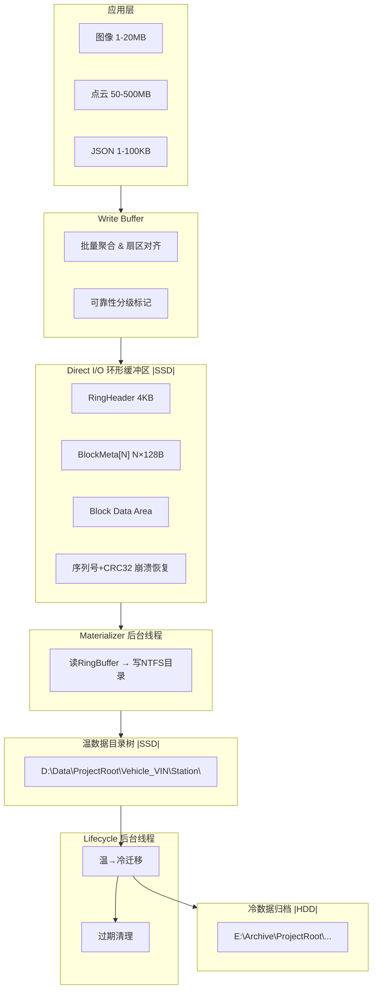

# 方案总览：环形缓冲摄入 + 异步目录物化

## 一句话总结

借鉴 SQLite WAL 的"写入→WAL追加→checkpoint后台合并"模式，将方案4的 Direct I/O 环形缓冲区作为写入前端（WAL），通过轻量后台 Materializer 异步物化为标准 NTFS 目录树，解决"高性能单文件"与"可浏览多文件"的核心矛盾。

---

## 核心矛盾

| 方案4（Direct I/O 环形缓冲区） | 多文件目录树方案 |
|---|---|
| ✅ 零CPU拷贝、零Page Cache污染 | ✅ Windows Explorer 可直接浏览 |
| ✅ 零运行时元数据抖动 | ✅ 复制粘贴拖拽正常 |
| ✅ 延迟可预测 | ✅ 符合业务层级规范 |
| ❌ 单文件不可浏览（违反R1） | ❌ 运行时NTFS元数据抖动（卡顿根因） |

→ **解决思路**：写径与读径分离，checkpoint（物化）是唯一调优杠杆。

---

## 架构图



### 物理部署

```
SSD (D:\):
  D:\RingBuffer\ring.dat         → 64GB 预分配环形缓冲区 (热数据)
  D:\Data\ProjectRoot\            → 物化目录树 (温数据, 1-30天)

HDD (E:\):
  E:\Archive\ProjectRoot\         → 归档目录 (冷数据, 30-365天)
```

---

## 核心组件

| 组件 | 职责 | I/O方式 | 线程 |
|------|------|---------|------|
| **Ring Buffer 引擎** | 接收写入请求，Direct I/O同步写入环形缓冲区 | `FILE_FLAG_NO_BUFFERING` | 调用者线程（同步） |
| **Write Buffer** | 批量聚合小文件（<64KB），扇区对齐 | 内存操作 + 最终触发一次Direct I/O | 调用者线程 |
| **Materializer** | 后台读取Ring Buffer，物化为NTFS目录树 | Direct I/O读 Ring + Buffered I/O写目录 | 独立后台线程 |
| **Lifecycle** | 温→冷迁移（Robocopy），过期清理 | Buffered I/O | 独立后台线程 |
| **Stats 采集** | 收集性能指标、容量、异常标记 | 遍历BlockMeta + FindFirstFile | 独立后台线程 |

---

## 核心数据结构

- **`RingHeader`** (4KB)：magic, write_cursor, committed_seq, materialized_seq, crc32
- **`BlockMeta`** (128B×N)：sequence, timestamp, actual_size, file_path, reliability, flags, data_crc32
- **`EngineStats`**：容量、性能、异常标记

详细定义见 [[core-data-structures.h]]

---

## 四条路径

### 写路径（同步，关键路径）
```
Write(req) → Write Buffer 聚合(小文件) → _aligned_malloc → 
WriteFile(Block数据) → WriteFile(BlockMeta) → WriteFile(Header) → 通知Materializer
```
- 严格顺序：数据 → Meta → Header（崩溃恢复的基础）
- 延迟来源：DMA传输（主导） + 系统调用（~5μs） + Header更新（~0.1ms）

### 读路径（按需查询）
```
Read(file_path) → 优先读物化目录树 → 回退读Ring Buffer
```
- 99%的读取走物化目录（OS已缓存）
- 仅物化延迟窗口内的高频写入需回退读Ring Buffer

### 物化路径（异步，不阻塞写入）
```
Materializer唤醒 → 读Block → 创建目录 → tmp文件写入 → ReplaceFileW原子重命名 → 更新Meta
```

### 迁移路径（异步，不触碰Ring Buffer）
```
Lifecycle扫描 → 检测温数据>30天 → Robocopy /MOV → HDD归档 → 删除温区副本
```

---

## 与开源方案对标

| 开源方案 | 核心技巧 | 本方案对应 |
|---------|---------|-----------|
| **SQLite WAL** | 写入→WAL追加, checkpoint后台合并 | Ring Buffer = WAL, Materializer = Checkpoint |
| **Voron (RavenDB)** | 全局单一IO Ring, 批量提交 | 单Ring Buffer文件 = 全局唯一IO目标 |
| **Bitcask** | 日志结构存储 + 内存索引 | Ring Buffer环形覆盖 + BlockMeta数组索引 |

---

## 参考

- [[requirements.md]] — 十大需求完整定义
- [[磁盘存储多方案.html]] — 方案4核心设计（预分配+Direct I/O）
- [[wiki/concepts/write-amplification.md]] @based_on — 写放大分析
- [[wiki/concepts/copy-on-write.md]] @based_on — CoW原子写入
