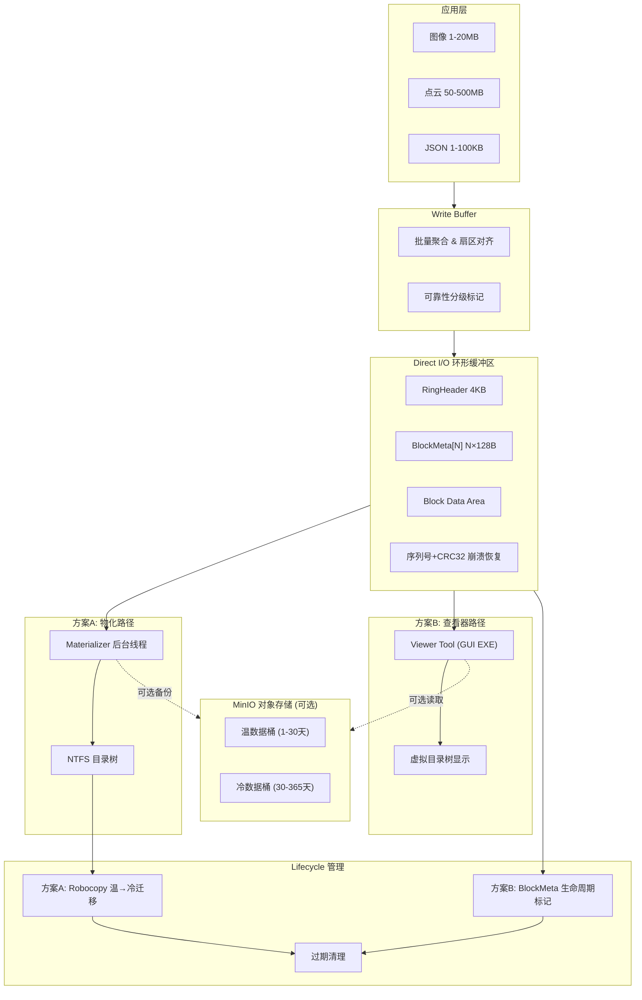

# 方案总览：环形缓冲摄入 + 双路径消费方案

## 一句话总结

借鉴 SQLite WAL 的"写入→WAL追加→checkpoint后台合并"模式，将方案4的 Direct I/O 环形缓冲区作为写入前端（WAL）。消费端提供两条路径，可独立选择或并存：

- **方案 A（物化）**：Materializer 后台线程将 Ring Buffer 中的 Block 异步物化为标准 NTFS 目录树
- **方案 B（查看器）**：Viewer Tool 读取 Ring Buffer 元数据，在工具内展示虚拟目录树

两条路径各有权衡：方案 A 提供原生 Windows Explorer 体验但多消耗磁盘 I/O 和空间；方案 B 零额外 I/O 但需专用查看工具。

---

## 核心矛盾

| 方案4（Direct I/O 环形缓冲区） | 多文件目录树方案 | 方案A：物化 | 方案B：Viewer Tool |
|---|---|---|---|
| ✅ 零CPU拷贝、零Page Cache污染 | ✅ Windows Explorer 可直接浏览 | ✅ 后台Materializer写真实NTFS文件 | ✅ Viewer Tool直接读Ring Buffer元数据 |
| ✅ 零运行时元数据抖动 | ✅ 复制粘贴拖拽正常 | ✅ 原生Explorer浏览、复制粘贴拖拽 | ✅ 零额外I/O开销（仅读~16KB元数据） |
| ✅ 延迟可预测 | ✅ 符合业务层级规范 | ❌ 额外I/O（每个Block多一次写入）和磁盘空间（2x） | ❌ 非原生Explorer（需专用EXE查看） |
| ❌ 单文件不可浏览（违反R1） | ❌ 运行时NTFS元数据抖动（卡顿根因） | → 适合磁盘空间充足、要求原生Explorer体验 | → 适合最小化I/O、愿意使用专用工具 |

→ **解决思路**：写径与读径分离，消费端作为可插拔模块。checkpoint（物化）或元数据索引是唯一调优杠杆。

---

## 架构图



### 物理部署

**默认：单盘部署**（典型场景——电脑只有 SSD 或 HDD 一种盘）

```
<单盘 (C: 或 D:)>:
  <Drive>:\RingBuffer\ring.dat       → 64GB 预分配环形缓冲区 (热数据)
  <Drive>:\Data\ProjectRoot\         → 物化目录树 (方案A, 温数据, 1-30天)
  <Drive>:\Archive\ProjectRoot\      → 归档目录 (方案A, 冷数据, 30-365天)
```

**可选：双盘部署**（如存在 SSD + HDD 双盘）

```
SSD (D:\):
  D:\RingBuffer\ring.dat            → 64GB 预分配环形缓冲区 (热数据)
  D:\Data\ProjectRoot\              → 物化目录树 (方案A, 温数据)
HDD (E:\):
  E:\Archive\ProjectRoot\           → 归档目录 (方案A, 冷数据)
```

**可选：MinIO 后端**（本机或远程）

```
MinIO Server (本机 localhost:9000 或远程):
  warm-data/                        → 温数据对象桶 (方案A/B, 1-30天)
  cold-data/                        → 冷数据对象桶 (方案A/B, 30-365天)
```

---

## 核心组件

| 组件 | 职责 | I/O方式 | 线程 | 所属方案 |
|------|------|---------|------|---------|
| **Ring Buffer 引擎** | 接收写入请求，Direct I/O同步写入环形缓冲区 | `FILE_FLAG_NO_BUFFERING` | 调用者线程（同步） | 共用 |
| **Write Buffer** | 批量聚合小文件（<64KB），扇区对齐 | 内存操作 + 最终触发一次Direct I/O | 调用者线程 | 共用 |
| **Materializer** | 后台读取Ring Buffer，物化为NTFS目录树 | Direct I/O读 Ring + Buffered I/O写目录 | 独立后台线程 | A |
| **Viewer Tool** | 读取BlockMeta数组，在GUI中展示虚拟目录树，支持导出 | Direct I/O读 Ring（仅元数据, ~16KB） | 按需启动（用户双击EXE） | B |
| **Lifecycle A** | 温→冷迁移（Robocopy），过期清理 | Buffered I/O | 独立后台线程 | A |
| **Lifecycle B** | 扫描BlockMeta年龄+可靠性，标记Block覆盖/保留状态 | 内存操作 + Direct I/O写Meta | 独立后台线程 | B |
| **MinIO Client** | Block上传到MinIO桶 / 从MinIO下载恢复 | 网络（HTTP/S3 API） | 后台线程（可选） | 共用（可选） |
| **Stats 采集** | 收集性能指标、容量、异常标记 | 遍历BlockMeta + FindFirstFile | 独立后台线程 | 共用 |

---

## 核心数据结构

- **`RingHeader`** (4KB)：magic, write_cursor, committed_seq, materialized_seq, crc32
- **`BlockMeta`** (128B×N)：sequence, timestamp, actual_size, file_path, reliability, flags, data_crc32
- **`EngineStats`**：容量、性能、异常标记

详细定义见 [[core-data-structures.h]]

---

## 双路径消费方案详解

方案 A 和方案 B 是两种互补的消费路径，可独立选择，也可并存。核心区别在于"如何让用户看到目录结构"。

| 维度 | 方案A：物化 | 方案B：Viewer Tool |
|------|-----------|-------------------|
| **浏览方式** | Windows Explorer 原生浏览 NTFS 目录树 | 启动 `StorageViewer.exe`，在 GUI 中查看虚拟目录树 |
| **复制/粘贴/拖拽** | 原生支持（标准 NTFS 文件） | 导出按钮——将选中文件复制到用户指定目录 |
| **数据新鲜度** | 物化延迟 < 1秒 | 即时（直接读 BlockMeta，无延迟） |
| **额外 I/O 开销** | 每 Block 多 1 次读 + 1 次写（写放大 = 2） | 0（仅读 ~16KB 元数据） |
| **额外磁盘空间** | 2x（Ring Buffer + NTFS 副本） | 1x（仅 Ring Buffer） |
| **实现复杂度** | ~200 行 C++（创建目录 + 写文件 + 批次解析） | ~300 行 C++/Win32 GUI（TreeView + 列表 + 导出） |
| **适用场景** | 磁盘空间充足、必须用 Explorer 浏览 | 最小化 I/O 和磁盘占用、可用专用工具 |

### 方案 A：Materializer 物化

保留现有 Materializer 线程逻辑：读取 Ring Buffer → 创建目录 → 临时文件写入 → `ReplaceFileW` 原子重命名。物化后的文件为标准 NTFS 文件，支持所有 Windows 文件操作。

数据流：`Ring Buffer → Materializer → NTFS Directory Tree`

### 方案 B：Viewer Tool 查看器

一个独立的 Windows GUI 应用程序（`StorageViewer.exe`），不使用 Materializer：

1. 以 Direct I/O 只读共享模式打开 `ring.dat`
2. 读取 `RingHeader` + `BlockMeta[N]`（约 16KB，一次顺序读）
3. 从所有 `BlockMeta.file_path` 字段构建内存中的目录树
4. 左侧 TreeView 显示层级结构，右侧列表显示文件名、大小、时间戳、可靠性级别
5. "导出选中"按钮：将选中 Block 的数据从 Ring Buffer 读出并写入用户指定目录
6. 可配置轮询间隔（默认 1 秒）检测新 Block 到达

数据流：`Ring Buffer → (直接读) → Viewer Tool 内存 → GUI 展示`

### MinIO 集成（可选，A/B 均可用）

MinIO 作为可选的温/冷存储后端，与方案 A/B 解耦：

- **作为温存储**：Block 提交到 Ring Buffer 后，异步上传到 MinIO 温数据桶
- **作为冷存储**：超过 30 天的 Block 迁移到 MinIO 冷数据桶，本地 Block 标记为可覆盖
- **作为恢复源**：本地 Block 损坏时，可从 MinIO 恢复（辅助崩溃恢复路径）
- **Block-to-Object 映射**：`bucket/prefix/{file_path_hash}_{sequence}.bin`
- **非阻塞设计**：MinIO 不可达时，本地存储完全正常工作，零影响

---

## 五条路径

### 写路径（同步，关键路径 — A/B 共用）
```
Write(req) → Write Buffer 聚合(小文件) → _aligned_malloc → 
WriteFile(Block数据) → WriteFile(BlockMeta) → WriteFile(Header) → 通知消费端
```
- 严格顺序：数据 → Meta → Header（崩溃恢复的基础）
- 延迟来源：DMA传输（主导） + 系统调用（~5μs） + Header更新（~0.1ms）

### 读路径-A（方案A：物化目录查询）
```
Read(file_path) → 优先读物化目录树 → 回退读Ring Buffer
```
- 99%的读取走物化目录（OS已缓存）
- 仅物化延迟窗口内的高频写入需回退读Ring Buffer

### 读路径-B（方案B：Viewer Tool 元数据查询）
```
Read(file_path) → 查BlockMeta数组(FNV-1a hash, O(1)) → 读对应Block数据区
```
- 元数据查询为纯内存操作（BlockMeta数组常驻内存）
- 数据读取为 Direct I/O（与写入路径相同的扇区对齐要求）

### 物化路径（方案A，异步，不阻塞写入）
```
Materializer唤醒 → 读Block → 创建目录 → tmp文件写入 → ReplaceFileW原子重命名 → 更新Meta
```

### 迁移路径-A（方案A，异步，不触碰Ring Buffer）
```
Lifecycle A扫描 → 检测温数据>30天 → Robocopy /MOV → 归档 → 删除温区副本
```

### 迁移路径-B（方案B，基于BlockMeta生命周期标记）
```
Lifecycle B扫描BlockMeta数组 → 检查timestamp+reliability → 
  温→冷: 可选上传MinIO + 标记FLAG_ARCHIVED_OVERWRITABLE
  过期: 标记FLAG_FREE
```
- 纯内存扫描，无文件系统 I/O
- 无 MinIO 时，冷数据保留在 Ring Buffer 中（受限于 64GB 容量）

### MinIO 路径（可选，异步，不阻塞写入/消费）
```
Block已提交 → MinIO Client入队 → HTTP PUT到温数据桶 → 更新BlockMeta.minio_object_hash
30天后 → Lifecycle触发迁移 → COPY到冷数据桶 → DELETE温数据桶对象 → 标记FLAG_MINIO_COLD
```

---

## 与开源方案对标

| 开源方案 | 核心技巧 | 本方案对应 |
|---------|---------|-----------|
| **SQLite WAL** | 写入→WAL追加, checkpoint后台合并 | Ring Buffer = WAL, Materializer/Viewer = Checkpoint |
| **Voron (RavenDB)** | 全局单一IO Ring, 批量提交 | 单Ring Buffer文件 = 全局唯一IO目标 |
| **Bitcask** | 日志结构存储 + 内存索引 | Ring Buffer环形覆盖 + BlockMeta数组索引 |
| **MinIO** | S3兼容对象存储, 桶生命周期策略 | 可选温/冷存储后端, 委托过期策略给MinIO服务端 |

---

## 参考

- [[requirements.md]] — 十大需求完整定义
- [[磁盘存储多方案.html]] — 方案4核心设计（预分配+Direct I/O）
- [[wiki/concepts/write-amplification.md]] @based_on — 写放大分析
- [[wiki/concepts/copy-on-write.md]] @based_on — CoW原子写入
