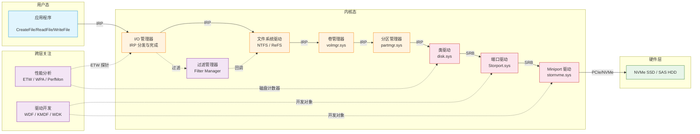

# Windows 高性能存储 — 知识总览图

> **维护规则**：此总览图由 AI 在每次 Ingest 操作后自动检查更新。
> 纳入标准（tier-1 页面）：
> - `storage-stack/` 全部页面
> - `filesystems/` 全部页面
> - `protocols/` 主要协议页面
> - `solutions/` 核心方案页面
> - 概念页或硬件页需被 3+ 页面引用才纳入

## 存储栈全景图

## 页面索引

| 层级 | 页面 | 说明 |
|------|------|------|
| **存储栈** | [[storage-stack/i-o-manager\|I/O 管理器]] | IRP 生命周期，I/O 子系统核心 |
| | [[storage-stack/file-system-drivers\|文件系统驱动]] | NTFS/ReFS 驱动架构与过滤管理器 |
| | [[storage-stack/volume-manager\|卷管理器]] | volmgr.sys，动态磁盘，卷管理 |
| | [[storage-stack/partition-manager\|分区管理器]] | partmgr.sys，GPT/MBR 分区 |
| | [[storage-stack/class-drivers\|类驱动]] | disk.sys，通用磁盘抽象 |
| | [[storage-stack/port-drivers\|端口驱动]] | Storport 架构与设计 |
| | [[storage-stack/miniport-drivers\|Miniport 驱动]] | 厂商 Miniport 模型 |
| **文件系统** | [[filesystems/ntfs\|NTFS]] | Windows 主文件系统内部原理 |
| | [[filesystems/refs\|ReFS]] | 弹性文件系统，CoW 与完整性 |
| | [[filesystems/csvfs\|CSVFS]] | 集群共享卷文件系统 |
| **协议** | [[protocols/nvme\|NVMe]] | NVMe 协议及 Windows 驱动栈实现 |
| **驱动开发** | [[driver-model/wdf-kmdf\|WDF/KMDF]] | Windows 驱动框架 |
| | [[driver-model/storport-miniport-dev\|Storport Miniport 开发]] | Storport Miniport 开发指南 |
| **性能** | [[performance/windows-perf-tooling\|Windows 性能工具链]] | ETW, WPR, WPA, PerfMon |
| **方案** | [[solutions/storage-spaces\|Storage Spaces / S2D]] | 存储空间与直通存储 |
| | [[solutions/smb-storage\|SMB 存储]] | SMB Direct, Scale-Out File Server |
| **概念** | [[concepts/copy-on-write\|Copy-on-Write]] | CoW 在 Windows 中的实现 |
| | [[concepts/write-amplification\|写放大]] | Windows 存储栈中的写放大 |
| | [[concepts/wear-leveling\|磨损均衡]] | SSD 磨损均衡与 Windows TRIM |
